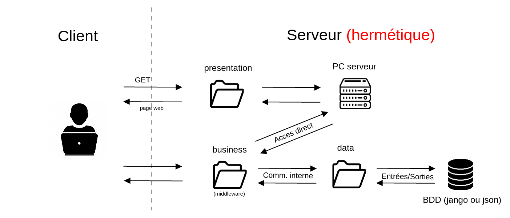

## Fonctions utilitaires

### Arguments

Permet de lancer le projet quand vous êtes dans le répertoire racine.

```bash
$ node main.js
```
Puis rendez vous sur votre navigateur pour utiliser l'API.
Tapez : 
```
http://localhost:3000
```
## Architecture



# Consignes

L'objectif est de fournir 2 projets : 

- Un projet Front End comportant des écrans permettant de :
    - Consulter la liste des clients
    - Ajouter un client
    - Modifier un client 
    - Supprimer un client
    - Voir les statistiques de la base de client

Le projet FrontEnd comporte un serveur web qui permet de lancer l'application web.
La partie écran peut être développée en javascript Vanilla, JQuery, Angular, VueJS ou ReactJS. 
L'application Front End appelle directement le projet BackEnd pour en récupérer et envoyer les données.

- Un projet BackEnd :
    - Lister les clients
    - Ajouter un client
    - Modifier un client
    - Supprimer un client
    - (bonus) récupérer les statistiques

Il est possible de faire les mêmes actions en ligne de commande
Au démarrage de l'application, on peut choisir en passant en paramètre un  stockage en fichier ou en BDD (en utilisant https://cloud.mongodb.com/ par exemple).
	
Le projet BackEnd doit être structuré avec un découpage logique.
Les 2 projets doivent utiliser eslint, avec un fichier package.json pour pouvoir installer les dépendances.
	
Chaque projet doit être sur github ou gitlab, avec une explication dans le Readme pour en expliquer le déploiement. (merci d'en faire le test avant pour vous assurer du bon fonctionnement). Les liens doivent être mis dans le fichier suivant : 
Et les droits en accès doivent être donné à manoel.deligny@gmail.com
Le git ne doit pas comporter les librairies utilisées dans le projet.
Le git doit comporter l’historique des push et commits pour voir l’évolution de vos applications.

Le contrôle des champs doit être fait autant dans le FrontEnd que dans l'API du BackEnd.